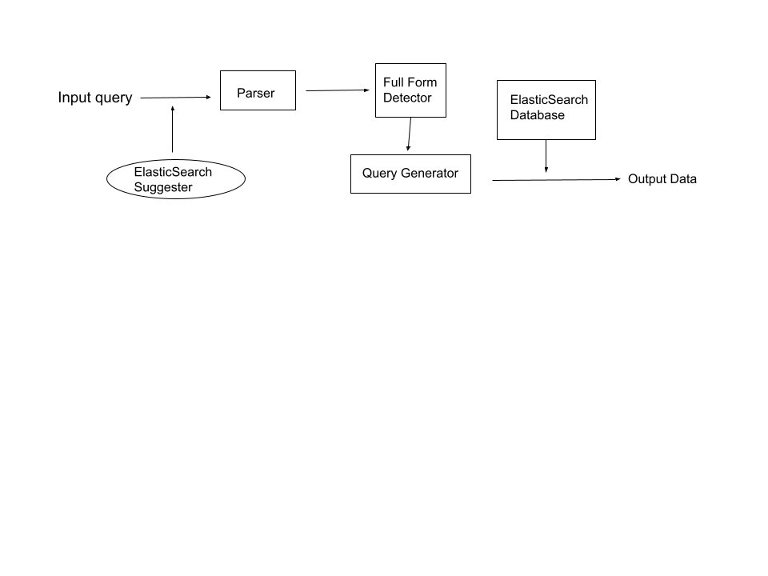

# ElasticSearch Database and API of the MAG dataset
This module contains functions that send `GET` requests to the Elasticsearch database of the [Microsoft Academic Graph](https://www.microsoft.com/en-us/research/project/microsoft-academic-graph/) data built in the `Osprey1` server of the University of Illinois at Urbana-Champaign. [Google Scholar](https://scholar.google.com) serves as a benchmark system through functions that fetches search results from Google Scholar and compares that from the database. Also, this module supports search for acronyms through a scraper that scrapes for the [Wikipedia](https://en.wikipedia.org/wiki/Main_Page)'s result for the most likely institutions the acronyms refer to.

With the ElasticSearch database used primarily for fuzzy match with text search and the MySQL database built by Forward Data Lab used for exact match, an API wrapper is constructed using [OpenAPI](https://swagger.io/resources/open-api/) and [SwaggerUI](https://swagger.io/tools/swagger-ui/) for users to search for data rows in the MAG dataset.
## About the database
* Refer to [Microsoft Academic Graph data schema](https://docs.microsoft.com/en-us/academic-services/graph/reference-data-schema) for details of indexes.
    * All indexes correspond to an entity with the same name in the MAG dataset from Azure, except for `paper_abstracts` index converted the indexed abstract from `PaperAbstractsInvertedIndex` table to full text. 
* The database is hosted in the University's server ```Osprey1.csl.illinois.edu```. 
* To access the Kibana interface of the ElasticSearch database, 
    * Connect to the University's VPN or Use the University's network
    * Go to http://128.174.136.27:5602/app/home#/ in a browser
    * Log in with the username and password
* The indexes' information is as follows. Go to ```Kibana Interface -> Tool Bar -> Management -> Stack management -> Data -> Index Management``` for data schemas.
<p align="center"><p>

    
## Setup
* Log in to the University's server ```Osprey1.csl.illinois.edu```.
* Clone the repository to the server.
* Run ```pip install -r src/requirements.txt```
* Run ```python src/app.py```
* Go to http://128.174.136.27:8080/v1/ui/#/ in a browser to access the SwaggerUI for API
* Open Kibana dashboard in a browser, log in using username and password, and interact with the REST API of ElasticSearch in `Dev Tools`.   
## Overview    
```
ElasticSearch-MAG-Database
    - config/ 
        -- Elasticsearch/
          --- elasticsearch.yml
        -- Kibana/
          --- kibana.yml
        -- Logstash/
          --- logstash_author.conf
          --- logstash_affil.conf
          --- logstash_paper_author.conf
          --- logstash_paper.conf
          --- logstash_paper_reference.conf
          --- logstash_json.conf 
          --- logstash_paper_abstract.conf
    - src/
        -- app.py
        -- resolve.py
        -- searcher/
            --- es_searcher/
                ---- es_searcher.py
                ---- scholar.py
            --- sql_searcher/
                ---- sql_searcher.py
                ---- DigiCertGlobalRootCA.crt.pem
            --- full_form_detector/
                ---- full_form_detector.py
                ---- chromedriver
            --- searcher.py
        -- swagger/
            --- api_specification.yml
        -- requirements.txt
        -- data/
            --- R1R2_research_college_cs_faculty.csv
```
* ```config/``` contains configuration files used for Elaticsearch, Kibana and Logstash.
* ```src/app.py``` hosts the API
* ```src/resolve.py``` resolves the paths defined in ```src/swagger/api_specification.yml``` and connect them to backend methods defined in ```src/searcher/searcher.py```
* ```src/searcher/searcher.py``` combines the ElasticSearch database for fuzzy match of text search and the MySQL database for exact match
    * ```src/searcher/es_searcher``` defines the class ```es_searcher``` that is connected to the Elasticsearch database and supports making search query to the database or perform cross index search, e.g. search for all papers published by an author given the author's name and author's affiliation. 
    * ```src/searcher/es_searcher/scholar.py```compares the result of query from ElasticSearch and that from Google Scholar to verify the performance.
    * ```src/searcher/sql_searcher``` defines the class ```sql_searcher``` that is connected to the research group's MySQL database and supports making searche query to the database.
    * ```src/searcher/full_form_detector``` scrapes for the full form of an academic institution given its acronym in Wikipedia. 
## Functional Design
<p align="center"><p>
    
## Built with
This module uses the following open source packages:
* [Elasticsearch](https://www.elastic.co/guide/en/elasticsearch/reference/current/index.html)
* [Kibana](https://www.elastic.co/guide/en/kibana/current/index.html)
* [Logstash](https://www.elastic.co/guide/en/logstash/current/index.html)
* [Beautiful Soup](https://beautiful-soup-4.readthedocs.io/en/latest/#)
* [OpenAPI 3.0](https://swagger.io/resources/open-api/)
## Author
Jiaqi Cao
